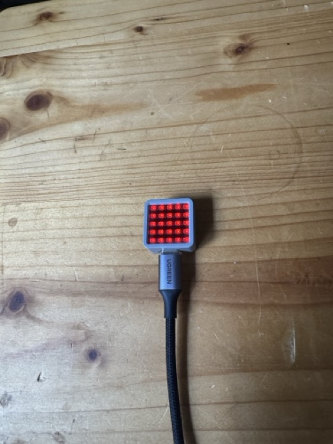
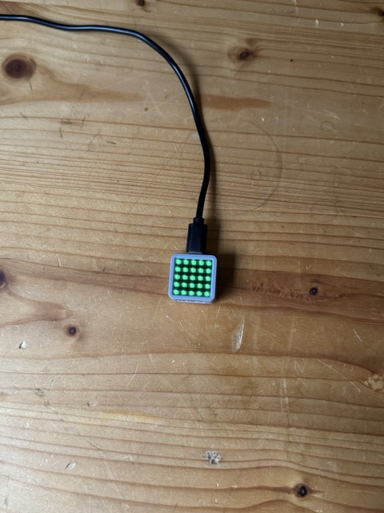

# Sunseeker mower remote control

This repository is an remote control Tool for controlling an Sunseeker robotic mower on an model plane airfield. The task is to prevent the mower from working when the rc pilots will use the airfield. A status LED is visualizing the current airfield status. We want to hide all the configruation issues of the Sunseeker app and have only a simple user interface.

* **RED**: Airfield is blocked by the mower
* **BLUE**: Mower is in transition
* **GREEN**: Airfield is free and can be used by the rc pilots





To achieve long mowing times, the airfield can be manually freed by the pilots by pushing a button to send the mower back to the garage. If the airfield is no loger used by the pilots, the mower could be started again by pushing the button.

**Button commands**

Status RED --> Pushing the Button will send the mower to the garage

Status GREEN --> Pushing the Button will start the mower to mow the airfield

The solution is build using the Arduino Framework and the Platform IO environment. It is deployed on an M5 Atom Matrix ESP32 controller. 

## Prerequesites

* [M5Atom Matrix ESP32 controller](https://shop.m5stack.com/products/atom-matrix-esp32-development-kit)
* [PlatformIO installation](https://platformio.org)
* WiFi connection
* Sunseeker robot mower

## Setup

To build and upload the project on your ESP32 controller, you have to enter the following credentials in the ```main.cppp``` file:

```c
const char *WifiSsid = "ENTER_YOUR_WIFI_SSID";
const char *WifiPassword = "ENTER_YOUR_WIFI_PASSWORD";
String username = "ENTER_YOUR_SUNSEEKER_LOGIN_EMAIL";
String password = "ENTER_YOUR_SUNSEEKER_LOGIN_PASSWORD";
```

Then Upload the project with the [PlatformIO](https://platformio.org) and check the Serial monitoring.

## Bruno collection

To test all needed API calls, a Bruno (https://usebruno.com) was developed. Just enter the following two properties in the environment settings of the bruno collection:

username = Your login email 
password = Your login password

With this information, you can 

* GET a token
* GET a list of all devices
* GET the specific settings of a device

## Credits

Many thanks [@Sdahl1234](https://github.com/Sdahl1234) for publishing https://github.com/Sdahl1234/Sunseeker-lawn-mower I could gain valuable insights about the API, the authorization and the data structures of the Sunseeker robot mowers. 

